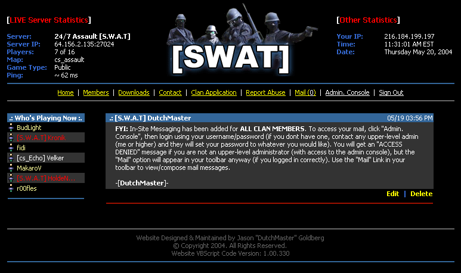



## A1 FULL CGI/ASP Website Using only VB6, with Login, Administration, and Internal Messaging \(Updated\)

### Description

This is a website I created COMPLETELY with VB6, and Access. It is a web page for a counter-strike clan I am affiliated with. I thought it best to share this code with my fellow programmers because it is TRUELY a great example of how to make a FULLY functional, interactive website with: Login, Administration, Messaging, News Posting, Live Server Stats, Security Levels, Privilleges, etc.. I've used this type of code for E-Commerce Websites (SupplyCounter.com), CRM Services (Alpha-Quote.com), and much much more. In order to use this, the compiled exe must be placed on your server in a directory where people can execute EXE files, the Database (mdb file) needs to be uploaded to the same folder, and any CONSTs (pointing to the database path, etc..) must be changed. The initial logon is "admin/admin". Please comment and vote!
 
### More Info
 

             |
---                |---
**Submitted On**   |2004-05-20 11:28:14
**By**             |[\[\]\)utch\[\]v\[\]aster](https://github.com/Planet-Source-Code/PSCIndex/blob/master/ByAuthor/utch-v-aster.md)
**Level**          |Advanced
**User Rating**    |4.8 (63 globes from 13 users)
**Compatibility**  |VB 5\.0, VB 6\.0
**Category**       |[Internet/ HTML](https://github.com/Planet-Source-Code/PSCIndex/blob/master/ByCategory/internet-html__1-34.md)
**World**          |[Visual Basic](https://github.com/Planet-Source-Code/PSCIndex/blob/master/ByWorld/visual-basic.md)
**Archive File**   |[A1\_FULL\_CG1748135202004\.zip](https://github.com/Planet-Source-Code/utch-v-aster-a1-full-cgi-asp-website-using-only-vb6-with-login-administration-and-internal__1-53906/archive/master.zip)

